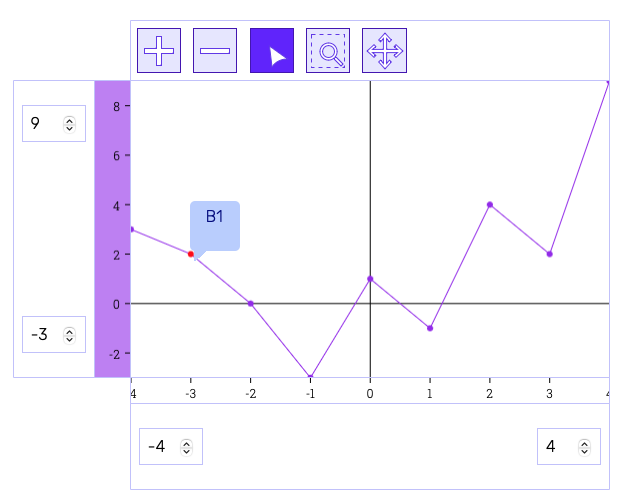

# Technical Overview of Chart à la carte

## Interactive Business Charts Web UI Toolkit

Bachelor Thesis of Valentina Giampa & Roger Kreienbühl



Image above: A chart created with the SimpleChartProjector() and the corresponding SimpleLineChartController().

# Intro

This file provides a general overview of the structure of the Business Charts Toolkit.

# Basic structure

On the [home page](https://github.com/rkreienbuehl/FHNW_ip6_Kolibri-Business-Charts/blob/main/BusinessCharts/index.html)
you can test the examples.
In addition, a detailed
[First Steps Guide](https://github.com/rkreienbuehl/FHNW_ip6_Kolibri-Business-Charts/blob/main/demo/first-steps/first-steps.html)
is available.
The sections below give a brief overview of the structure.
To build your own charts, at least an HTML and a JavaScript file is required.
The easiest way to use the projectors is to make a copy of the entire
[src folder](https://github.com/rkreienbuehl/FHNW_ip6_Kolibri-Business-Charts)
in the respective project.


## HTML

To be able to display the charts in the browser, a div with the corresponding id is created.
``` html
<!--- chart section --->
<div class="container" id="container"></div>
```
The charts are created in a [Javascript file in type "module"](demo/first-steps/first-steps-demo.js).
The .js is included in the **Script section**.
``` html
<!--- script section --->
<script src="your-chart-script.js" type="module"></script>
```
To arrange the axes of the charts correctly, at least
grid.css and charts-base.css are required.
``` html
<!--- css section --->
<!--- needed --->
<link rel="stylesheet" href="../src/business-charts/css/grid.css">
<link rel="stylesheet" href="../src/business-charts/css/charts-base.css">
```

## Styles

To ensure that the axes are displayed in the correct order,
at least grid.css and charts-base.css should be included.
All available CSS styles are listed here and can be changed / extended as desired:

|                      | css location                                         | 
|----------------------|------------------------------------------------------|
| Business Charts      |                                                      |
| Chart Grid           | src/business-charts/css/grid.css                     | 
| Chart Basic Style    | src/business-charts/css/charts-base.css              | 
| Tooltip              | src/business-charts/css/selectionTool.css            | 
| Detail View          | src/business-charts/css/simpleDetailView.css         |
| Data Table View      | src/business-charts/css/dataTableView.css            |
|                      |                                                      |
| Kolibri              |                                                      |
| Kolibri Base Colors  | src/kolibri/docs/css/kolibri-base.css                |
| Kolibri Light Colors | src/kolibri/docs/css/kolibri-light-colors.css        |
| Kolibri Fonts        | src/kolibri/docs/css/kolibri-light-fonts.css         |

## Script

The script file is the central location for the use of the respective projectors.

The structure is as follows

1. Imports of the respective projectors -> Make sure that the imports end with .js (change in the settings or extend manually with .js).
2. Provide a data serie in a constant.
3. Passing the data to the controller.
4. Pass the controller to the projector and attach it to the DOM.

[//]: # (Im First Steps Beispiel wird die Erstellung einer Scatter Chart mit einer Tabellen-/Detailansicht für die Datenpunkte demonstriert.)

[//]: # (Siehe auch [first-steps-demo.js]&#40;demo/first-steps/first-steps-demo.js&#41; um den Code direkt zu sehen.)

Create a data array of the type "ChartDataElement"
``` js
/** @type { Array.<ChartDataElement> } */ const data = [ {
name: 'A', xValue: -4, yValue: 3,
}, {
name: 'B', xValue: -3, yValue: 2,
}, ];
```

Create a chart controller with the above data as an argument (the toolbar is optional).
``` js
const controller = SimpleScatterChartController(data, {
        tools: [
            zoomInTool,
            zoomOutTool,
            bubbleTooltipSelectionTool,
            rubberBandTool,
            panningTool,
        ]
    });
```

Append the projector to the HTML with the controller as argument.
``` js
document.getElementById('container').append(
SimpleChartProjector(controller));
```
# Projector / Controller Combination

This section provides an overview of the projectors, controllers and toolbar tools.
and describes where to find them (this is needed for the import).

## One Data Serie

If only one data series is used, the corresponding controller in SimpleChartProjector is used in JavaScript.

|                          | code                                                                                                              | import from                      |
|--------------------------|-------------------------------------------------------------------------------------------------------------------|----------------------------------|
| data (max. 1 data serie) | ``` @type { Array.<ChartDataElement> } */ ``` <br/> ``` const data = [ {name: 'A', xValue: -4, yValue: 3,},]; ``` |
| Scatter Chart controller | ``` const controller = SimpleScatterChartController(data, {...tools...}); ```                                     | ``` simpleChartController.js ``` |
| Line Chart controller    | ``` const controller = SimpleLineChartController(data, {...tools...}); ```                                        | ``` simpleChartController.js ``` |
| Area Chart controller    | ``` const controller = SimpleAreaChartController(data, {...tools...}); ```                                        | ``` simpleChartController.js ``` |
| Simple Chart Projector   | ``` document.getElementById('container').append(SimpleChartProjector(controller)); ```                            | ``` simpleChartProjector.js ```  |

## More than one Data Serie

If several data series are in use, the corresponding controller in the AdvancedChartProjector is used in the JavaScript.

|                           | code                                                                                                               | import from                        |
|---------------------------|--------------------------------------------------------------------------------------------------------------------|------------------------------------|
| data (min. 2 data series) | ``` @type { Array.<ChartDataElement> } */ ``` <br/> ``` const data1 = [ {name: 'A', xValue: -4, yValue: 3,},]; ``` |                                    |
|                           | ``` @type { Array.<ChartDataElement> } */ ``` <br/> ``` const data2 = [ {name: 'A', xValue: -1, yValue: 6,},]; ``` |                                    |
| Scatter Chart controller  | ``` const controller = ScatterChartController( [data1, data2], {...tools...}); ```                                 | ``` advancedChartController.js ``` |
| Line Chart controller     | ``` const controller = LineChartController( [data1, data2], {...tools...}); ```                                    | ``` advancedChartController.js ``` |
| Area Chart controller     | ``` const controller = AreaChartController( [data1, data2], {...tools...}); ```                                    | ``` advancedChartController.js ``` |            
| Advanced Chart Projector  | ``` document.getElementById('container').append(AdvancedChartProjector(controller)); ```                           | ``` advancedChartProjector.js ```  |

## Different Data Serie representations

If the data series are displayed differently, the general ChartController with specification of the chart type is available for the AdvancedProjector.

|                              | code                                                                                                                                                                                                                              | import from                        |
|------------------------------|-----------------------------------------------------------------------------------------------------------------------------------------------------------------------------------------------------------------------------------|------------------------------------|
| data (min. 2 data series)    | ``` @type { Array.<ChartDataElement> } */ ``` <br/> ``` const data1 = [ {name: 'A', xValue: -4, yValue: 3,},]; ```                                                                                                                |                                    |
|                              | ``` @type { Array.<ChartDataElement> } */ ``` <br/> ``` const data2 = [ {name: 'A', xValue: -1, yValue: 6,},]; ```                                                                                                                |                                    |
|                              | ``` @type { Array.<ChartDataElement> } */ ``` <br/> ``` const data3 = [ {name: 'A', xValue: 1,  yValue: 9,},]; ```                                                                                                                |                                    |
| Mixed Chart Types controller | ``` const controller = ChartController([ ``` <br/> ``` { type: SCATTER_CHART, data: data1 }, ``` <br/> ``` { type: LINE_CHART, data: data2 }, ``` <br/> ``` { type: AREA_CHART, data: data3 }], ``` <br/> ``` {...tools...}); ``` | ``` advancedChartController.js ``` |
| Advanced Chart Projector     | ``` document.getElementById('container').append(AdvancedChartProjector(controller)); ```                                                                                                                                          | ``` advancedChartProjector.js ```  |

## Toolbar

Usage of toolbar as second argument in, for example, SimpleScatterChartController:
``` js
const controller = SimpleScatterChartController(data, {
tools: [
zoomInTool,
zoomOutTool,
bubbleTooltipSelectionTool,
rubberBandTool,
panningTool,
]
});
```

|                            | import as                              | import from                  |
|----------------------------|----------------------------------------|------------------------------|
| zoomInTool                 | ``` { zoomInTool } ```                 | ``` ZoomInTool.js ```        | 
| zoomOutTool                | ``` { zoomOutTool } ```                | ``` ZoomOut.js ```           |
| bubbleTooltipSelectionTool | ``` { bubbleTooltipSelectionTool } ``` | ``` SelectionTool.js ```     |
| rubberBandTool             | ``` { rubberBandTool } ```             | ``` RubberbandTool.js ```    |
| panningTool                | ``` { panningTool } ```                | ``` PanningTool.js ```       |

## Detail View and Data Table View

|                             | append as                                                                                                                                                                                                                                                                                                                                                                                                                              | import from                                                               |
|-----------------------------|----------------------------------------------------------------------------------------------------------------------------------------------------------------------------------------------------------------------------------------------------------------------------------------------------------------------------------------------------------------------------------------------------------------------------------------|---------------------------------------------------------------------------|
| detail View                 | ``` SimpleDetailView(controller) ```                                                                                                                                                                                                                                                                                                                                                                                                   | ``` simpleDetailViewProjector.js ```                                      |
| data table view             | ``` DataTableViewProjector(DataTableViewController(controller, controller.getSeries()[0]), 'Data points serie 1') ```                                                                                                                                                                                                                                                                                                                  | ``` dataTableViewProjector.js ``` <br/> ``` dataTableViewController.js``` |
| add table view to classList | ``` const tableViews = document.createElement("div"); ``` <br/> ``` tableViews.classList.add("data-table-views"); ``` <br/> ```  tableViews.append(  ``` <br/> ``` DataTableViewProjector(DataTableViewController(controller, controller.getSeries()[0]), 'Data points serie 1'), ``` <br/> ``` DataTableViewProjector(DataTableViewController(controller, controller.getSeries()[1]), 'Data points serie 2'), ``` <br/> ```  );  ```  | ``` dataTableViewProjector.js ``` <br/> ``` dataTableViewController.js``` |


Clicking on a data point can display further information.
For this, the SimpleDetailView() projector is used with the already created controller and this is attached to a div.
The data series can also be displayed in tabular form.
The DataTableViewProjector() with the DataTableViewController() is used for this.

### Simple Detail View

For the use of these projectors, a further div element is needed in the HTML file.

``` html

<div class="detail-view" id="detail-view"></div>

```

In the script file, a constant is needed for the above element.

``` js

const detailView = document.getElementById('detail-view');

```

Now the already created chart controller can be passed
as an argument to the ```SimpleDetailView()``` projector and attached to the html file.

``` js

detailView.append(SimpleDetailView(controller);

``` 


### Data Table View


The data points can also be displayed as a table. They are also attached to the detail view projector.

``` js

detailView.append(

DataTableViewProjector(DataTableViewController(controller, controller.getSeries()[0]), 'Data points serie 1'),

DataTableViewProjector(DataTableViewController(controller, controller.getSeries()[1]), 'Data points serie 2'),

);

``` 


### New div class list for the Data Table Views

It is also possible to use the classList property...

``` js

const tableViews = document.createElement("div");

tableViews.classList.add("data-table-views");

tableViews.append(

    DataTableViewProjector(DataTableViewController(controller, controller.getSeries()[0]), 'Data points serie 1'),

    DataTableViewProjector(DataTableViewController(controller, controller.getSeries()[1]), 'Data points serie 2'),

    );

``` 

...and attach them to the detail view projector.

``` js

detailViewMulti.append(

SimpleDetailView(controller),

tableViews

);

```

# Features

This section gives a brief overview of the functionalities of the Business Charts Toolkit.

|                     | Chart                                       | Toolbar                                                                                       | Simple Axes*       | Advanced Axes*                                                                              | Simple Detail View                   | Data Table View                                      |
|---------------------|---------------------------------------------|-----------------------------------------------------------------------------------------------|--------------------|---------------------------------------------------------------------------------------------|--------------------------------------|------------------------------------------------------|
| Select Data Points  | Yes, has Detail View and Table View Binding |                           | No                 | No                                                                                          | No, has Chart and Table View Binding | Yes, has Chart and Detail View Binding               |
| Multi Selection     | No, has Table View Binding                  | No                                                                                            | No                 | No                                                                                          | No, has Table View Binding           | Yes, has Chart and Detail View Binding (Cmd + Click) |
| Zoom In             | Yes                                         |                          | Input Fields       | Yes (Y-Axis: Cmd + MouseDraggedMoveUp), (X-Axis: MouseDown + MouseMove on left boundary)    | No                                   | No                                                   |
| Zoom Out            | Yes                                         |                       | Input Fields       | Yes (Y-Axis: Cmd + MouseDraggedMoveDown), (X-Axis: MouseDown + MouseMove on right boundary) | No                                   | No                                                   |
| Rubber Band Zooming | Yes                                         |  | No                 | No                                                                                          | No                                   | No                                                   |
| Panning             | Yes                                         |                            | Input Field Arrows | Yes (Y-Axis: Alt + MouseDrag), (X-Axis: MouseDown + MouseMove on data range)                | No                                   | No                                                   |
| Tooltip             | Yes                                         | Yes                                                                                           | No                 | No                                                                                          | No, has Chart Binding                | No, has Chart Binding                                |

*Explanation of axes:

SimpleAxis: This axis is currently available for the SimpleProjector (one data series).

AdvancedAxis: This axis is currently available for the AdvancedProjector (several data series).

# Structure of the Toolkit

There are several ways to use the toolkit.
The easiest way is to copy the complete src folder into the project.
Alternatively, only the projectors effectively used can be copied.
Since the toolkit has no external dependencies, the size is minimal and has no impact on performance.

## /src

This directory contains the entire Kolibri Web UI Toolkit (/src/Kolibri) and the Kolibri Test Cases at root level.
It was the basis for the development of Kolibri Business Charts.
The current version of the Kolibri Web UI Toolkit is available at the
[Kolibri Website](https://webengineering-fhnw.github.io/Kolibri/index.html).
The contents of the Business Charts folder are described in more detail in the next section.

### /src/business-charts

This folder contains all projectors (/src/business-charts/projector)
and styles (/src/business-charts/css) for building a charts web app.
The utils folder (/src/business-charts/utils) contains util functions that are necessary for the chart projectors.

### /src/business-charts/util

The util folder contains all functions for the respective calculations of the chart components.

### /src/business-charts/projector
This folder contains all projectors and their controllers with the corresponding tests.
The MVC structure allows for a fast replacement of the projectors.

### /src/business-charts/css

To display the charts correctly, gris.css and charts-base.css are required as a minimum.
Otherwise, the axes are not in the correct grid arrangement.
The remaining files are optional and provide a base styling.
It is possible to extend the .css files, overwrite them or replace them with your own files.

### Live Tests

The current status of the tests is available in the root directory of the Business Charts in the file
[allBusinessChartsTests.html](../../src/business-charts/allBusinessChartsTests.html).

### JSDoc

Documentation based on JSDoc is available for the specification of objects, functions, etc.
General information about JSDoc is available on their [Website](https://jsdoc.app/index.html).


[//]: # (# FHNW IP6 - Interaktive Business Charts für das Kolibri Web UI Toolkit)

[//]: # ()
[//]: # (Bachelor Thesis von Valentina Giampa & Roger Kreienbühl)

[//]: # ()
[//]: # (## Intro)

[//]: # ()
[//]: # (Kolibri Business Charts ist die Erweiterung des [Kolibri Web UI Toolkit]&#40;https://github.com/WebEngineering-FHNW/Kolibri&#41;.)

[//]: # (Das Ziel ist ein "Sortiment von Elementen", die die Entwicklung von Webanwendungen vereinfachen.)

[//]: # (Geschäftsanwendungen haben oft eine große Anzahl von Clients.)

[//]: # (Der schlanke und strukturierte Aufbau des Toolkits verwendet das [Projector Pattern]&#40;https://dierk.github.io/Home/projectorPattern/ProjectorPattern.html&#41; in einer klassischen [MVC-Architektur]&#40;https://ieeexplore.ieee.org/abstract/document/950428&#41;.)

[//]: # (Dies ermöglicht eine schnelle und kostengünstige Änderung des "Look-and-Feel" der Geschäftsanwendung.)

[//]: # ()
[//]: # (## Baue Geschäftsapplikationen für die Datenanalyse mit wenigen Codezeilen)

[//]: # ()
[//]: # (Mit Kolibri Business Charts können schnell interaktive Diagramme für Datenanalysen entwickelt werden.)

[//]: # (Es bietet Projektoren für den Aufbau von Diagrammen als Baukastensystem.)

[//]: # (Dies bietet eine hohe Flexibilität, um Datenanalyst*innen jene Anwendung bereitzustellen, die sie benötigen.)

[//]: # ()
[//]: # (## Aufbau und Verwendung des Toolkits)

[//]: # ()
[//]: # (Es gibt mehrere Möglichkeiten, das Toolkit zu verwenden.)

[//]: # (Der einfachste Weg ist den kompletten src-Ordner in das Projekt zu kopieren.)

[//]: # (Da das Toolkit keine externen Abhängigkeiten hat, ist die Größe minimal.)

[//]: # (Daher hat es praktisch keine Auswirkungen auf die Leistung.)

[//]: # (Das Toolkit erfordert plain JavaScript, HTML5, CSS und eine IDE.)

[//]: # ()
[//]: # (### /src)

[//]: # ()
[//]: # (Dieses Verzeichnis enthält das gesamte Kolibri Web UI Toolkit &#40;/src/Kolibri&#41; und die Kolibri Test Cases auf Root-Ebene.)

[//]: # (Es war die Basis für die Entwicklung von Kolibri Business Charts. )

[//]: # (Die aktuelle Version des Kolibri Web UI Toolkits ist auf der )

[//]: # ([Kolibri Website]&#40;https://webengineering-fhnw.github.io/Kolibri/index.html&#41; beschrieben. )

[//]: # (Der Inhalt des Business-Charts-Ordners wird im nächsten Abschnitt genauer beschrieben.)

[//]: # ()
[//]: # (#### /src/business-charts)

[//]: # ()
[//]: # (In diesem Ordner sind alle Projektoren &#40;/src/business-charts/projector&#41; )

[//]: # (und Styles &#40;/src/business-charts/css&#41; für den Aufbau einer Charts-Web-App enthalten.)

[//]: # (Im utils-Ordner &#40;/src/business-charts/utils&#41; sind Hilfsfunktionen abgelegt, welche für die Chart-Projektoren notwendig sind.)

[//]: # ()
[//]: # (#### /src/business-charts/util)

[//]: # ()
[//]: # (Der Ordner util enthält alle Hilfsfunktionen für die jeweiligen Berechnungen der Diagrammkomponenten.)

[//]: # ()
[//]: # (#### /src/business-charts/projector)

[//]: # (Dieser Ordner enthält alle Projektoren und deren Controller mit den entsprechenden Tests.)

[//]: # (We die Projektoren verwendet werden ist im Abschnitt First Steps beschrieben. )

[//]: # (Die klare Strukturierung erlaubt den einfachen Austausch der Projektoren.)

[//]: # ()
[//]: # (#### /src/business-charts/css)

[//]: # ()
[//]: # (Um die Charts korrekt darzustellen, werden im Minimum gris.css und charts-base.css benötigt. )

[//]: # (Andernfalls befinden sich die Achsen nicht in der richtigen Rasteranordnung. )

[//]: # (Die restlichen Dateien sind optional und bieten eine Grundlage für das Styling.)

[//]: # (Es ist möglich, die .css Dateien zu erweitern, sie zu überschreiben oder durch eigene Dateien zu ersetzen.)

[//]: # ()
[//]: # (#### Live Tests)

[//]: # ()
[//]: # (Der aktuelle Stand der Tests ist im Root Verzeichnis der Business Charts im File [allBusinessChartsTests.html]&#40;../../src/business-charts/allBusinessChartsTests.html&#41; abrufbar.)

[//]: # ()
[//]: # (### /demo)

[//]: # ()
[//]: # (Im Demo-Ordner sind Beispiele für die Verwendung der Business Charts Projektoren enthalten. )

[//]: # (Das kurze Tutorial First Steps erklärt in wenigen Schritten die Verwendung.)

[//]: # ()
[//]: # (#### JSDoc)

[//]: # ()
[//]: # (Für die Spezifikation der Objekte, Funktionen, etc. steht eine auf JSDoc basierende Dokumentation zur Verfügung.)

[//]: # (Allgemeine Informationen über JSDoc sind auf der [Website]&#40;https://jsdoc.app/index.html&#41; verfügbar.)

[//]: # ()
[//]: # (## Features)

[//]: # ()
[//]: # (Dieser Abschnitt gibt einen kurzen Überblick über die Funktionalitäten des Business Charts Toolkits.)

[//]: # ()
[//]: # (|                     | Chart                                       | Toolbar  | Simple Axis        | Advanced Axis | Simple Detail View                   | Data Table View                        |)

[//]: # (|---------------------|---------------------------------------------|----------|--------------------|---------------|--------------------------------------|----------------------------------------|)

[//]: # (| Select Data Points  | Yes, has Detail View and Table View Binding | Standard | No                 | No            | No, has Chart and Table View Binding | Yes, has Chart and Detail View Binding |)

[//]: # (| Multi Selection     | No, has Table View Binding                  | No       | No                 | No            | No, has Table View Binding           | Yes, has Chart and Detail View Binding |)

[//]: # (| Zooming             | Yes                                         | Yes      | Input Fields       | Yes           | No                                   | No                                     |)

[//]: # (| Rubber Band Zooming | Yes                                         | Yes      | No                 | No            | No                                   | No                                     |)

[//]: # (| Panning             | Yes                                         | Yes      | Input Field Arrows | Yes           | No                                   | No                                     |)

[//]: # (| Tooltip             | Yes                                         | Yes      | No                 | No            | No, has Chart Binding                | No, has Chart Binding                  |)

[//]: # ()
[//]: # (## First Steps)

[//]: # ()
[//]: # (Hier ist eine kurze Anleitung zur Erstellung eines Diagramms, wie es in der folgenden Abbildung dargestellt ist.)

[//]: # ()
[//]: # (![Ausschnitt Demo App]&#40;../../demo/assets/images/first-steps-demo.png "DemoApp"&#41;)

[//]: # ()
[//]: # (### 1. HTML erstellen)

[//]: # ()
[//]: # (Siehe [demo/howto.html]&#40;../../demo/first-steps/first-steps-demo.js&#41;)

[//]: # ()
[//]: # (Um die Charts im Browser nutzen zu können, wird ein div benötigt.)

[//]: # (``` html)

[//]: # (<!--- chart section --->)

[//]: # (<div class="container" id="container"></div>)

[//]: # (```)

[//]: # (Die Charts werden in einer [Javascript-Datei im type "module"]&#40;../../demo/first-steps/first-steps-demo.js&#41; erstellt.)

[//]: # (Das .js wird in der **Script-Section** eingebunden.)

[//]: # (``` html)

[//]: # (<!--- script section --->)

[//]: # (<script src="your-chart-script.js" type="module"></script>)

[//]: # (```)

[//]: # (Wie oben bereits beschrieben, wird mindestens )

[//]: # (grid.css und charts-base.css für die korrekte Anordnung der Achsen benötigt.)

[//]: # (``` html)

[//]: # (<!--- css section --->)

[//]: # (<!--- needed --->)

[//]: # (<link rel="stylesheet" href=".../src/business-charts/css/grid.css">)

[//]: # (<link rel="stylesheet" href=".../src/business-charts/css/charts-base.css">)

[//]: # ()
[//]: # (<!--- optional --->)

[//]: # (<link rel="stylesheet" href=".../business-charts specific files...">)

[//]: # (<link rel="stylesheet" href=".../kolibri specific files...">)

[//]: # (<link rel="stylesheet" href=".../your own files...">)

[//]: # (```)

[//]: # ()
[//]: # (### 2. Script erstellen)

[//]: # ()
[//]: # (Siehe [first-steps-demo.js]&#40;../../demo/first-steps/first-steps-demo.js&#41;)

[//]: # ()
[//]: # (In diesem Beispiel werden Projektoren verwendet für die Erstellung einer Scatter Chart)

[//]: # (mit einer Tabellen-/Detailansicht für die Datenpunkte.)

[//]: # ()
[//]: # (Ein Daten-Array vom Typ "ChartDataElement" erstellen)

[//]: # (``` js)

[//]: # (/** @type { Array.<ChartDataElement> } */ const data = [ {)

[//]: # (name: 'A', xValue: -4, yValue: 3,)

[//]: # (}, {)

[//]: # (name: 'B', xValue: -3, yValue: 2,)

[//]: # (}, ];)

[//]: # (```)

[//]: # ()
[//]: # (Einen Chart Controller mit den obigen Daten als Argument erstellen &#40;die Toolbar ist optional&#41;.)

[//]: # (``` js)

[//]: # (const controller = SimpleScatterChartController&#40;data, {)

[//]: # (        tools: [)

[//]: # (            zoomInTool,)

[//]: # (            zoomOutTool,)

[//]: # (            bubbleTooltipSelectionTool,)

[//]: # (            rubberBandTool,)

[//]: # (            panningTool,)

[//]: # (        ])

[//]: # (    }&#41;;)

[//]: # (```)

[//]: # ()
[//]: # (Den Projektor mit dem controller als Argument an das HTML anbinden.)

[//]: # (``` js)

[//]: # (document.getElementById&#40;'container'&#41;.append&#40;)

[//]: # (SimpleChartProjector&#40;controller&#41;&#41;;)

[//]: # (```)

[//]: # ()
[//]: # (### 3. Styles einbinden)

[//]: # ()
[//]: # (Wie bereits in der Strukturierung der Business Charts erwähnt, werden im Minimum grid.css und charts-base.css benötigt.)

[//]: # ()
[//]: # (Das Ausführen des HTML's sollte ein ähnliches Ergebnis haben wie unten angezeigt.)

[//]: # (![Ausschnitt Simple Scatter Chart]&#40;../../demo/assets/images/simple-scatter-chart.png "scatter chart example"&#41;)

[//]: # ()
[//]: # (## Austauschbarkeit)

[//]: # ()
[//]: # (Der Vorteil von Kolibri Web UI Toolkit ist die schnelle Anpassung der Anzeige &#40;das "Wie"&#41;.)

[//]: # (Sie ist komplett unabhängig von den Daten und der Logik &#40;das "Was"&#41;.)

[//]: # ()
[//]: # (### Charts mit einer Datenserie)

[//]: # ()
[//]: # (Soll die Datenserie als Line Chart dargestellt werden, wird der zugehörige controller ausgetauscht.)

[//]: # (``` js)

[//]: # (const controller = SimpleLineChartController&#40;data, {...}&#41;;)

[//]: # (```)

[//]: # (Für Charts mit einer Datenserie steht der SimpleChartProjector&#40;&#41; zur Verfügung.)

[//]: # (``` js)

[//]: # (SimpleChartProjector&#40;controller&#41;;)

[//]: # (```)

[//]: # ()
[//]: # (### Charts mit mehr als einer Datenserie)

[//]: # ()
[//]: # (Gibt es mehr als eine Datenserie, wird der controller ohne den Zusatz 'Simple' benötigt.)

[//]: # (Die Datenserien werden nun als Array übergeben.)

[//]: # ()
[//]: # (``` js)

[//]: # (const controller = LineChartController&#40; [data, data2], {...}&#41;;)

[//]: # (```)

[//]: # ()
[//]: # (Um diesen nutzen zu können, wird der AdvancedChartProjector&#40;&#41; benötigt.)

[//]: # ()
[//]: # (``` js)

[//]: # (AdvancedChartProjector&#40;controller&#41;;)

[//]: # (```)

[//]: # ( )
[//]: # (### Charts mit unterschiedlichen Darstellungen der Datenserien)

[//]: # ()
[//]: # (Für die Steuerung der unterschiedlichen Darstellung jeder einzelnen Datenserie steht der ChartController&#40;&#41; zur Verfügung.)

[//]: # (``` js)

[//]: # (const controller = ChartController&#40;)

[//]: # (            [)

[//]: # (            { type: SCATTER_CHART, data: data  },)

[//]: # (            { type: SCATTER_CHART, data: data2 },)

[//]: # (            { type: LINE_CHART,    data: data3 })

[//]: # (            ],)

[//]: # (            {...}&#41;;)

[//]: # (```)

[//]: # ()
[//]: # (Dieser ist nur in Verbindung mit dem AdvancedChartProjector&#40;&#41; verwendbar.)

[//]: # (``` js)

[//]: # (AdvancedChartProjector&#40;ChartProjector&#40;controller&#41;&#41;;)

[//]: # (```)

[//]: # ()
[//]: # (## Multiple Darstellung der Datenpunkte)

[//]: # ()
[//]: # (Die Datenpunkte können, neben der Chart-Darstellung, in einer detaillierten Ansicht ```SimpleDetailView&#40;&#41;```)

[//]: # (oder in tabellarischer Form ```DataTableViewProjector&#40;DataTableViewController&#40;&#41;&#41;``` angezeigt werden.)

[//]: # ()
[//]: # (### Simple Detail View)

[//]: # ()
[//]: # (Für die Nutzung dieser Projektoren wird ein weiteres div-Element in der HTML-Datei erstellt werden.)

[//]: # ()
[//]: # (``` html)

[//]: # (<div class="detail-view" id="detail-view"></div>)

[//]: # (```)

[//]: # ()
[//]: # (Im Script wird nun eine Konstante für das obige Element benötigt.)

[//]: # ()
[//]: # (``` js)

[//]: # (const detailView = document.getElementById&#40;'detail-view'&#41;;)

[//]: # (```)

[//]: # ()
[//]: # (Jetzt kann der bereits erstellte chart controller dem ```SimpleDetailView&#40;&#41;``` Projektor als Argument übergeben )

[//]: # (und and das html angehängt werden.)

[//]: # (``` js)

[//]: # (detailView.append&#40;SimpleDetailView&#40;controller&#41;;)

[//]: # (``` )

[//]: # ()
[//]: # (### Data Table View)

[//]: # ()
[//]: # (Die Datenpunkte können ebenfalls als Tabelle angezeigt werden. Sie werden ebenfalls an die detail view angehängt.)

[//]: # ()
[//]: # (``` js)

[//]: # (detailView.append&#40;)

[//]: # (DataTableViewProjector&#40;DataTableViewController&#40;controller, controller.getSeries&#40;&#41;[0]&#41;, 'Data points serie 1'&#41;,)

[//]: # (DataTableViewProjector&#40;DataTableViewController&#40;controller, controller.getSeries&#40;&#41;[1]&#41;, 'Data points serie 2'&#41;,)

[//]: # (&#41;;)

[//]: # (``` )

[//]: # ()
[//]: # (### Neue div class list für die Data Table Views)

[//]: # ()
[//]: # (Es ist ebenfalls möglich die classList property zu verwenden...)

[//]: # ()
[//]: # (``` js)

[//]: # (const tableViews = document.createElement&#40;"div"&#41;;)

[//]: # (tableViews.classList.add&#40;"data-table-views"&#41;;)

[//]: # (tableViews.append&#40;)

[//]: # (    DataTableViewProjector&#40;DataTableViewController&#40;controller, controller.getSeries&#40;&#41;[0]&#41;, 'Data points serie 1'&#41;,)

[//]: # (    DataTableViewProjector&#40;DataTableViewController&#40;controller, controller.getSeries&#40;&#41;[1]&#41;, 'Data points serie 2'&#41;,)

[//]: # (    &#41;;)

[//]: # (``` )

[//]: # ()
[//]: # (...und diese an die detail view anzuhängen.)

[//]: # ()
[//]: # (``` js)

[//]: # (detailViewMulti.append&#40;)

[//]: # (SimpleDetailView&#40;controller&#41;,)

[//]: # (tableViews)

[//]: # (&#41;;)

[//]: # (```)
