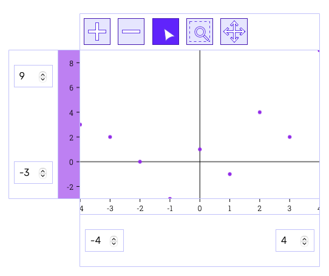

# FHNW IP6 - Interaktive Business Charts für das Kolibri Web UI Toolkit

Bachelor Thesis von Valentina Giampa & Roger Kreienbühl

## Intro

Kolibri Business Charts ist die Erweiterung des [Kolibri Web UI Toolkit](https://github.com/WebEngineering-FHNW/Kolibri).
Das Ziel ist ein "Sortiment von Elementen", die die Entwicklung von Webanwendungen vereinfachen.
Geschäftsanwendungen haben oft eine große Anzahl von Clients.
Der schlanke und strukturierte Aufbau des Toolkits verwendet das [Projector Pattern](https://dierk.github.io/Home/projectorPattern/ProjectorPattern.html) in einer klassischen [MVC-Architektur](https://ieeexplore.ieee.org/abstract/document/950428).
Dies ermöglicht eine schnelle und kostengünstige Änderung des "Look-and-Feel" der Geschäftsanwendung.

## Baue Geschäftsapplikationen für die Datenanalyse mit wenigen Codezeilen

Mit Kolibri Business Charts können schnell interaktive Diagramme für Datenanalysen entwickelt werden.
Es bietet Projektoren für den Aufbau von Diagrammen als Baukastensystem.
Dies bietet eine hohe Flexibilität, um Datenanalyst*innen jene Anwendung bereitzustellen, die sie benötigen.

## Aufbau und Verwendung des Toolkits

Es gibt mehrere Möglichkeiten, das Toolkit zu verwenden.
Der einfachste Weg ist den kompletten src-Ordner in das Projekt zu kopieren.
Da das Toolkit keine externen Abhängigkeiten hat, ist die Größe minimal.
Daher hat es praktisch keine Auswirkungen auf die Leistung.
Das Toolkit erfordert plain JavaScript, HTML5, CSS und eine IDE.

### /src

Dieses Verzeichnis enthält das gesamte Kolibri Web UI Toolkit (/src/Kolibri) und die Kolibri Test Cases auf Root-Ebene.
Es war die Basis für die Entwicklung von Kolibri Business Charts. 
Die aktuelle Version des Kolibri Web UI Toolkits ist auf der 
[Kolibri Website](https://webengineering-fhnw.github.io/Kolibri/index.html) beschrieben. 
Der Inhalt des Business-Charts-Ordners wird im nächsten Abschnitt genauer beschrieben.

#### /src/business-charts

In diesem Ordner sind alle Projektoren (/src/business-charts/projector) 
und Styles (/src/business-charts/css) für den Aufbau einer Charts-Web-App enthalten.
Im utils-Ordner (/src/business-charts/utils) sind Hilfsfunktionen abgelegt, welche für die Chart-Projektoren notwendig sind.

#### /src/business-charts/util

Der Ordner util enthält alle Hilfsfunktionen für die jeweiligen Berechnungen der Diagrammkomponenten.

#### /src/business-charts/projector
Dieser Ordner enthält alle Projektoren und deren Controller mit den entsprechenden Tests.
We die Projektoren verwendet werden ist im Abschnitt First Steps beschrieben. 
Die klare Strukturierung erlaubt den einfachen Austausch der Projektoren.

#### /src/business-charts/css

Um die Charts korrekt darzustellen, werden im Minimum gris.css und charts-base.css benötigt. 
Andernfalls befinden sich die Achsen nicht in der richtigen Rasteranordnung. 
Die restlichen Dateien sind optional und bieten eine Grundlage für das Styling.
Es ist möglich, die .css Dateien zu erweitern, sie zu überschreiben oder durch eigene Dateien zu ersetzen.

#### Live Tests

Der aktuelle Stand der Tests ist im Root Verzeichnis der Business Charts im File [allBusinessChartsTests.html](../../src/business-charts/allBusinessChartsTests.html) abrufbar.

### /demo

Im Demo-Ordner sind Beispiele für die Verwendung der Business Charts Projektoren enthalten. 
Das kurze Tutorial First Steps erklärt in wenigen Schritten die Verwendung.

#### JSDoc

Für die Spezifikation der Objekte, Funktionen, etc. steht eine auf JSDoc basierende Dokumentation zur Verfügung.
Allgemeine Informationen über JSDoc sind auf der [Website](https://jsdoc.app/index.html) verfügbar.

## Features

Dieser Abschnitt gibt einen kurzen Überblick über die Funktionalitäten des Business Charts Toolkits.

|                     | Chart                                       | Toolbar  | Simple Axis        | Advanced Axis | Simple Detail View                   | Data Table View                        |
|---------------------|---------------------------------------------|----------|--------------------|---------------|--------------------------------------|----------------------------------------|
| Select Data Points  | Yes, has Detail View and Table View Binding | Standard | No                 | No            | No, has Chart and Table View Binding | Yes, has Chart and Detail View Binding |
| Multi Selection     | No, has Table View Binding                  | No       | No                 | No            | No, has Table View Binding           | Yes, has Chart and Detail View Binding |
| Zooming             | Yes                                         | Yes      | Input Fields       | Yes           | No                                   | No                                     |
| Rubber Band Zooming | Yes                                         | Yes      | No                 | No            | No                                   | No                                     |
| Panning             | Yes                                         | Yes      | Input Field Arrows | Yes           | No                                   | No                                     |
| Tooltip             | Yes                                         | Yes      | No                 | No            | No, has Chart Binding                | No, has Chart Binding                  |

## First Steps

Hier ist eine kurze Anleitung zur Erstellung eines Diagramms, wie es in der folgenden Abbildung dargestellt ist.


### 1. HTML erstellen

Siehe [demo/howto.html](../../demo/first-steps/first-steps-demo.js)

Um die Charts im Browser nutzen zu können, wird ein div benötigt.
``` html
<!--- chart section --->
<div class="container" id="container"></div>
```
Die Charts werden in einer [Javascript-Datei im type "module"](../../demo/first-steps/first-steps-demo.js) erstellt.
Das .js wird in der **Script-Section** eingebunden.
``` html
<!--- script section --->
<script src="your-chart-script.js" type="module"></script>
```
Wie oben bereits beschrieben, wird mindestens 
grid.css und charts-base.css für die korrekte Anordnung der Achsen benötigt.
``` html
<!--- css section --->
<!--- needed --->
<link rel="stylesheet" href=".../src/business-charts/css/grid.css">
<link rel="stylesheet" href=".../src/business-charts/css/charts-base.css">

<!--- optional --->
<link rel="stylesheet" href=".../business-charts specific files...">
<link rel="stylesheet" href=".../kolibri specific files...">
<link rel="stylesheet" href=".../your own files...">
```

### 2. Script erstellen

Siehe [first-steps-demo.js](../../demo/first-steps/first-steps-demo.js)

In diesem Beispiel werden Projektoren verwendet für die Erstellung einer Scatter Chart
mit einer Tabellen-/Detailansicht für die Datenpunkte.

Ein Daten-Array vom Typ "ChartDataElement" erstellen
``` js
/** @type { Array.<ChartDataElement> } */ const data = [ {
name: 'A', xValue: -4, yValue: 3,
}, {
name: 'B', xValue: -3, yValue: 2,
}, ];
```

Einen Chart Controller mit den obigen Daten als Argument erstellen (die Toolbar ist optional).
``` js
const controller = SimpleScatterChartController(data, {
        tools: [
            zoomInTool,
            zoomOutTool,
            bubbleTooltipSelectionTool,
            rubberBandTool,
            panningTool,
        ]
    });
```

Den Projektor mit dem controller als Argument an das HTML anbinden.
``` js
document.getElementById('container').append(
SimpleChartProjector(controller));
```

### 3. Styles einbinden

Wie bereits in der Strukturierung der Business Charts erwähnt, werden im Minimum grid.css und charts-base.css benötigt.

Das Ausführen des HTML's sollte ein ähnliches Ergebnis haben wie unten angezeigt.


## Austauschbarkeit

Der Vorteil von Kolibri Web UI Toolkit ist die schnelle Anpassung der Anzeige (das "Wie").
Sie ist komplett unabhängig von den Daten und der Logik (das "Was").

### Charts mit einer Datenserie

Soll die Datenserie als Line Chart dargestellt werden, wird der zugehörige controller ausgetauscht.
``` js
const controller = SimpleLineChartController(data, {...});
```
Für Charts mit einer Datenserie steht der SimpleChartProjector() zur Verfügung.
``` js
SimpleChartProjector(controller);
```

### Charts mit mehr als einer Datenserie

Gibt es mehr als eine Datenserie, wird der controller ohne den Zusatz 'Simple' benötigt.
Die Datenserien werden nun als Array übergeben.

``` js
const controller = LineChartController( [data, data2], {...});
```

Um diesen nutzen zu können, wird der AdvancedChartProjector() benötigt.

``` js
AdvancedChartProjector(controller);
```
 
### Charts mit unterschiedlichen Darstellungen der Datenserien

Für die Steuerung der unterschiedlichen Darstellung jeder einzelnen Datenserie steht der ChartController() zur Verfügung.
``` js
const controller = ChartController(
            [
            { type: SCATTER_CHART, data: data  },
            { type: SCATTER_CHART, data: data2 },
            { type: LINE_CHART,    data: data3 }
            ],
            {...});
```

Dieser ist nur in Verbindung mit dem AdvancedChartProjector() verwendbar.
``` js
AdvancedChartProjector(ChartProjector(controller));
```

## Multiple Darstellung der Datenpunkte

Die Datenpunkte können, neben der Chart-Darstellung, in einer detaillierten Ansicht ```SimpleDetailView()```
oder in tabellarischer Form ```DataTableViewProjector(DataTableViewController())``` angezeigt werden.

### Simple Detail View

Für die Nutzung dieser Projektoren wird ein weiteres div-Element in der HTML-Datei erstellt werden.

``` html
<div class="detail-view" id="detail-view"></div>
```

Im Script wird nun eine Konstante für das obige Element benötigt.

``` js
const detailView = document.getElementById('detail-view');
```

Jetzt kann der bereits erstellte chart controller dem ```SimpleDetailView()``` Projektor als Argument übergeben 
und and das html angehängt werden.
``` js
detailView.append(SimpleDetailView(controller);
``` 

### Data Table View

Die Datenpunkte können ebenfalls als Tabelle angezeigt werden. Sie werden ebenfalls an die detail view angehängt.

``` js
detailView.append(
DataTableViewProjector(DataTableViewController(controller, controller.getSeries()[0]), 'Data points serie 1'),
DataTableViewProjector(DataTableViewController(controller, controller.getSeries()[1]), 'Data points serie 2'),
);
``` 

### Neue div class list für die Data Table Views

Es ist ebenfalls möglich die classList property zu verwenden...

``` js
const tableViews = document.createElement("div");
tableViews.classList.add("data-table-views");
tableViews.append(
    DataTableViewProjector(DataTableViewController(controller, controller.getSeries()[0]), 'Data points serie 1'),
    DataTableViewProjector(DataTableViewController(controller, controller.getSeries()[1]), 'Data points serie 2'),
    );
``` 

...und diese an die detail view anzuhängen.

``` js
detailViewMulti.append(
SimpleDetailView(controller),
tableViews
);
```
