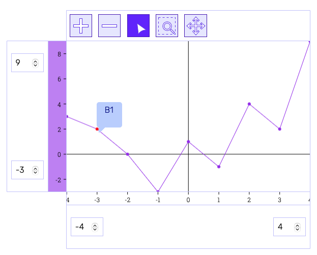
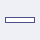

# Technical Overview of Chart à la carte

## Interactive Business Charts Web UI Toolkit

Bachelor Thesis of Valentina Giampa & Roger Kreienbühl



Image above: A chart created with the SimpleChartProjector() and the corresponding SimpleLineChartController().

# Intro

This file provides a general overview of the structure of the Business Charts Toolkit.

# Basic structure

On the [home page](../index.html)
you can test the examples.
In addition, a detailed
[First Steps Guide](../demo/first-steps/first-steps.html)
is available.
The sections below give a brief overview of the structure.
To build your own charts, at least an HTML and a JavaScript file is required.
The easiest way to use the projectors is to make a copy of the entire
[src folder](https://github.com/rkreienbuehl/FHNW_ip6_Kolibri-Business-Charts)
in the respective project.


## HTML

To be able to display the charts in the browser, a div with the corresponding id is created.
``` html
<!--- chart section --->
<div class="container" id="container"></div>
```
The charts are created in a [Javascript file in type "module"](../demo/first-steps/first-steps-demo.js).
The .js is included in the **Script section**.
``` html
<!--- script section --->
<script src="your-chart-script.js" type="module"></script>
```
To arrange the axes of the charts correctly, at least
grid.css and charts-base.css are required.
``` html
<!--- css section --->
<!--- needed --->
<link rel="stylesheet" href="../src/business-charts/css/grid.css">
<link rel="stylesheet" href="../src/business-charts/css/charts-base.css">
```

## Styles

To ensure that the axes are displayed in the correct order,
at least grid.css and charts-base.css should be included.
All available CSS styles are listed here and can be changed / extended as desired:

|                      | css location                                         | 
|----------------------|------------------------------------------------------|
| Business Charts      |                                                      |
| Chart Grid           | src/business-charts/css/grid.css                     | 
| Chart Basic Style    | src/business-charts/css/charts-base.css              | 
| Tooltip              | src/business-charts/css/selectionTool.css            | 
| Detail View          | src/business-charts/css/simpleDetailView.css         |
| Data Table View      | src/business-charts/css/dataTableView.css            |
|                      |                                                      |
| Kolibri              |                                                      |
| Kolibri Base Colors  | src/kolibri/docs/css/kolibri-base.css                |
| Kolibri Light Colors | src/kolibri/docs/css/kolibri-light-colors.css        |
| Kolibri Fonts        | src/kolibri/docs/css/kolibri-light-fonts.css         |

## Script

The script file is the central location for the use of the respective projectors.

The structure is as follows

1. Imports of the respective projectors -> Make sure that the imports end with .js (change in the settings or extend manually with .js).
2. Provide a data serie in a constant.
3. Passing the data to the controller.
4. Pass the controller to the projector and attach it to the DOM.

[//]: # (Im First Steps Beispiel wird die Erstellung einer Scatter Chart mit einer Tabellen-/Detailansicht für die Datenpunkte demonstriert.)

[//]: # (Siehe auch [first-steps-demo.js]&#40;demo/first-steps/first-steps-demo.js&#41; um den Code direkt zu sehen.)

Create a data array of the type "ChartDataElement"
``` js
/** @type { Array.<ChartDataElement> } */ const data = [ {
name: 'A', xValue: -4, yValue: 3,
}, {
name: 'B', xValue: -3, yValue: 2,
}, ];
```

Create a chart controller with the above data as an argument (the toolbar is optional).
``` js
const controller = SimpleScatterChartController(data, {
        tools: [
            zoomInTool,
            zoomOutTool,
            bubbleTooltipSelectionTool,
            rubberBandTool,
            panningTool,
        ]
    });
```

Append the projector to the HTML with the controller as argument.
``` js
document.getElementById('container').append(
SimpleChartProjector(controller));
```
# Projector / Controller Combination

This section provides an overview of the projectors, controllers and toolbar tools
and describes where to find them (this is needed for the import).

## One Data Serie

If only one data series is used, the corresponding controller in SimpleChartProjector is used in JavaScript.

|                          | code                                                                                                              | import from                      |
|--------------------------|-------------------------------------------------------------------------------------------------------------------|----------------------------------|
| data (max. 1 data serie) | ``` @type { Array.<ChartDataElement> } */ ``` <br/> ``` const data = [ {name: 'A', xValue: -4, yValue: 3,},]; ``` |
| Scatter Chart controller | ``` const controller = SimpleScatterChartController(data, {...tools...}); ```                                     | ``` simpleChartController.js ``` |
| Line Chart controller    | ``` const controller = SimpleLineChartController(data, {...tools...}); ```                                        | ``` simpleChartController.js ``` |
| Area Chart controller    | ``` const controller = SimpleAreaChartController(data, {...tools...}); ```                                        | ``` simpleChartController.js ``` |
| Simple Chart Projector   | ``` document.getElementById('container').append(SimpleChartProjector(controller)); ```                            | ``` simpleChartProjector.js ```  |

## More than one Data Serie

If several data series are in use, the corresponding controller in the AdvancedChartProjector is used in the JavaScript.

|                           | code                                                                                                               | import from                        |
|---------------------------|--------------------------------------------------------------------------------------------------------------------|------------------------------------|
| data (min. 2 data series) | ``` @type { Array.<ChartDataElement> } */ ``` <br/> ``` const data1 = [ {name: 'A', xValue: -4, yValue: 3,},]; ``` |                                    |
|                           | ``` @type { Array.<ChartDataElement> } */ ``` <br/> ``` const data2 = [ {name: 'A', xValue: -1, yValue: 6,},]; ``` |                                    |
| Scatter Chart controller  | ``` const controller = ScatterChartController( [data1, data2], {...tools...}); ```                                 | ``` advancedChartController.js ``` |
| Line Chart controller     | ``` const controller = LineChartController( [data1, data2], {...tools...}); ```                                    | ``` advancedChartController.js ``` |
| Area Chart controller     | ``` const controller = AreaChartController( [data1, data2], {...tools...}); ```                                    | ``` advancedChartController.js ``` |            
| Advanced Chart Projector  | ``` document.getElementById('container').append(AdvancedChartProjector(controller)); ```                           | ``` advancedChartProjector.js ```  |

## Different Data Serie representations

If the data series are displayed differently, the general ChartController with specification of the chart type is available for the AdvancedProjector.

|                           | code                                                                                                                                                                                                                                                         | import from                       |
|---------------------------|--------------------------------------------------------------------------------------------------------------------------------------------------------------------------------------------------------------------------------------------------------------|-----------------------------------|
| data (min. 2 data series) | ``` @type { Array.<ChartDataElement> } */ ``` <br/> ``` const data1 = [ {name: 'A', xValue: -4, yValue: 3,},]; ```                                                                                                                                           |                                   |
|                           | ``` @type { Array.<ChartDataElement> } */ ``` <br/> ``` const data2 = [ {name: 'A', xValue: -1, yValue: 6,},]; ```                                                                                                                                           |                                   |
|                           | ``` @type { Array.<ChartDataElement> } */ ``` <br/> ``` const data3 = [ {name: 'A', xValue: 1,  yValue: 9,},]; ```                                                                                                                                           |                                   |
| general controller*       | ``` const controller = ChartController(``` <br/> ```[ ``` <br/> ``` { type: SCATTER_CHART, data: data1 }, ``` <br/> ``` { type: LINE_CHART, data: data2 }, ``` <br/> ``` { type: AREA_CHART, data: data3 } ``` <br/> ```], ``` <br/> ``` {...tools...}); ``` | ``` chartController.js ```        |
| Advanced Chart Projector  | ``` document.getElementById('container').append(AdvancedChartProjector(controller)); ```                                                                                                                                                                     | ``` advancedChartProjector.js ``` |

*needs also the import of the used chart types

|               | import as                 | import from                |
|---------------|---------------------------|----------------------------|
| SCATTER_CHART | ``` { SCATTER_CHART } ``` | ``` chartController.js ``` | 
| LINE_CHART    | ``` { LINE_CHART } ```    | ``` chartController.js ``` |
| AREA_CHART    | ``` { AREA_CHART } ```    | ``` chartController.js ``` |


## Toolbar

Usage of toolbar as second argument in, for example, SimpleScatterChartController:
``` js
const controller = SimpleScatterChartController(data, {
tools: [
zoomInTool,
zoomOutTool,
bubbleTooltipSelectionTool,
rubberBandTool,
panningTool,
]
});
```

|                            | import as                              | import from                  |
|----------------------------|----------------------------------------|------------------------------|
| zoomInTool                 | ``` { zoomInTool } ```                 | ``` ZoomInTool.js ```        | 
| zoomOutTool                | ``` { zoomOutTool } ```                | ``` ZoomOut.js ```           |
| bubbleTooltipSelectionTool | ``` { bubbleTooltipSelectionTool } ``` | ``` SelectionTool.js ```     |
| rubberBandTool             | ``` { rubberBandTool } ```             | ``` RubberbandTool.js ```    |
| panningTool                | ``` { panningTool } ```                | ``` PanningTool.js ```       |

## Detail View and Data Table View

|                             | append as                                                                                                                                                                                                                                                                                                                                                                                                                              | import from                                                               |
|-----------------------------|----------------------------------------------------------------------------------------------------------------------------------------------------------------------------------------------------------------------------------------------------------------------------------------------------------------------------------------------------------------------------------------------------------------------------------------|---------------------------------------------------------------------------|
| detail View                 | ``` SimpleDetailView(controller) ```                                                                                                                                                                                                                                                                                                                                                                                                   | ``` simpleDetailViewProjector.js ```                                      |
| data table view             | ``` DataTableViewProjector(DataTableViewController(controller, controller.getSeries()[0]), 'Data points serie 1') ```                                                                                                                                                                                                                                                                                                                  | ``` dataTableViewProjector.js ``` <br/> ``` dataTableViewController.js``` |
| add table view to classList | ``` const tableViews = document.createElement("div"); ``` <br/> ``` tableViews.classList.add("data-table-views"); ``` <br/> ```  tableViews.append(  ``` <br/> ``` DataTableViewProjector(DataTableViewController(controller, controller.getSeries()[0]), 'Data points serie 1'), ``` <br/> ``` DataTableViewProjector(DataTableViewController(controller, controller.getSeries()[1]), 'Data points serie 2'), ``` <br/> ```  );  ```  | ``` dataTableViewProjector.js ``` <br/> ``` dataTableViewController.js``` |


Clicking on a data point can display further information.
For this, the SimpleDetailView() projector is used with the already created controller and this is attached to a div.
The data series can also be displayed in tabular form.
The DataTableViewProjector() with the DataTableViewController() is used for this.

### Simple Detail View

For the use of these projectors, a further div element is needed in the HTML file.

``` html

<div class="detail-view" id="detail-view"></div>

```

In the script file, a constant is needed for the above element.

``` js

const detailView = document.getElementById('detail-view');

```

Now the already created chart controller can be passed
as an argument to the ```SimpleDetailView()``` projector and attached to the html file.

``` js

detailView.append(SimpleDetailView(controller);

``` 


### Data Table View


The data points can also be displayed as a table. They are also attached to the detail view projector.

``` js

detailView.append(

DataTableViewProjector(DataTableViewController(controller, controller.getSeries()[0]), 'Data points serie 1'),

DataTableViewProjector(DataTableViewController(controller, controller.getSeries()[1]), 'Data points serie 2'),

);

``` 


### New div class list for the Data Table Views

It is also possible to use the classList property...

``` js

const tableViews = document.createElement("div");

tableViews.classList.add("data-table-views");

tableViews.append(

    DataTableViewProjector(DataTableViewController(controller, controller.getSeries()[0]), 'Data points serie 1'),

    DataTableViewProjector(DataTableViewController(controller, controller.getSeries()[1]), 'Data points serie 2'),

    );

``` 

...and attach them to the detail view projector.

``` js

detailViewMulti.append(

SimpleDetailView(controller),

tableViews

);

```

# Features

This section gives a brief overview of the functionalities of the Business Charts Toolkit.

|                     | Chart                                       | Toolbar                                                                                       | Simple Axes*       | Advanced Axes*                                                                              | Simple Detail View                   | Data Table View                                      |
|---------------------|---------------------------------------------|-----------------------------------------------------------------------------------------------|--------------------|---------------------------------------------------------------------------------------------|--------------------------------------|------------------------------------------------------|
| Select Data Points  | Yes, has Detail View and Table View Binding |                           | No                 | No                                                                                          | No, has Chart and Table View Binding | Yes, has Chart and Detail View Binding               |
| Multi Selection     | No, has Table View Binding                  | No                                                                                            | No                 | No                                                                                          | No, has Table View Binding           | Yes, has Chart and Detail View Binding (Cmd + Click) |
| Zoom In             | Yes                                         |                          | Input Fields       | Yes (Y-Axis: Cmd + MouseDraggedMoveUp), (X-Axis: MouseDown + MouseMove on left boundary)    | No                                   | No                                                   |
| Zoom Out            | Yes                                         |                       | Input Fields       | Yes (Y-Axis: Cmd + MouseDraggedMoveDown), (X-Axis: MouseDown + MouseMove on right boundary) | No                                   | No                                                   |
| Rubber Band Zooming | Yes                                         |  | No                 | No                                                                                          | No                                   | No                                                   |
| Panning             | Yes                                         |                            | Input Field Arrows | Yes (Y-Axis: Alt + MouseDrag), (X-Axis: MouseDown + MouseMove on data range)                | No                                   | No                                                   |
| Tooltip             | Yes                                         | Yes                                                                                           | No                 | No                                                                                          | No, has Chart Binding                | No, has Chart Binding                                |

*Explanation of axes:

SimpleAxis: This axis is currently available for the SimpleProjector (one data series).

AdvancedAxis: This axis is currently available for the AdvancedProjector (several data series).

# Structure of the Toolkit

There are several ways to use the toolkit.
The easiest way is to copy the complete src folder into the project.
Alternatively, only the projectors effectively used can be copied.
Since the toolkit has no external dependencies, the size is minimal and has no impact on performance.

## /src

This directory contains the entire Kolibri Web UI Toolkit (/src/Kolibri) and the Kolibri Test Cases at root level.
It was the basis for the development of Kolibri Business Charts.
The current version of the Kolibri Web UI Toolkit is available at the
[Kolibri Website](https://webengineering-fhnw.github.io/Kolibri/index.html).
The contents of the Business Charts folder are described in more detail in the next section.

### /src/business-charts

This folder contains all projectors (/src/business-charts/projector)
and styles (/src/business-charts/css) for building a charts web app.
The utils folder (/src/business-charts/utils) contains util functions that are necessary for the chart projectors.

### /src/business-charts/util

The util folder contains all functions for the respective calculations of the chart components.

### /src/business-charts/projector
This folder contains all projectors and their controllers with the corresponding tests.
The MVC structure allows for a fast replacement of the projectors.

### /src/business-charts/css

To display the charts correctly, gris.css and charts-base.css are required as a minimum.
Otherwise, the axes are not in the correct grid arrangement.
The remaining files are optional and provide a base styling.
It is possible to extend the .css files, overwrite them or replace them with your own files.

### Live Tests

The current status of the tests is available in the root directory of the Business Charts in the file
[allBusinessChartsTests.html](../../src/business-charts/allBusinessChartsTests.html).

### JSDoc

Documentation based on JSDoc is available for the specification of objects, functions, etc.
General information about JSDoc is available on their [Website](https://jsdoc.app/index.html).
