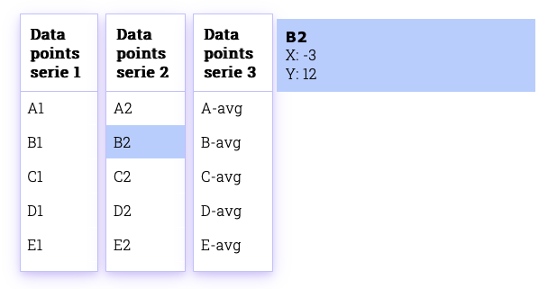

# Chart à la carte
## Interaktive Business Charts für das Kolibri Web UI Tookit

Bachelor Thesis von Valentina Giampa & Roger Kreienbühl

## Ausgangslage

Für Geschäftsapplikationen sind Datenvisualisierungstools ein wichtiger Bestandteil.
Bisherige Chart-Libraries bieten zwar verschiedene Chart-Typen, es fehlt jedoch ein Toolkit für interaktive Charts mit klassichem [MVC-Aufbau](https://ieeexplore.ieee.org/abstract/document/950428), damit die Daten und Logik vom "Aussehen" der Applikation getrennt sind.
Besonders im Geschäftsumfeld, wo viele Endgeräte im Einsatz sind, ist die Trennung der View wichtig, damit diese mit wenig Aufwand angepasst werden kann.

## Ziel der Arbeit

Erweiterung des bestehenden [Kolibri Web UI Toolkits](https://github.com/WebEngineering-FHNW/Kolibri) mit [Projektoren](https://dierk.github.io/Home/projectorPattern/ProjectorPattern.html) für die Datenvisualisierung, welche die Möglichkeit bieten Analysetools schnell und einfach zu bauen, individuell zu erweitern und beliebig auszutauschen.

## Ergebnisse

Im Rahmen dieses Projekts wurden verschiedene Projektoren erstellt, um eine oder mehrere Datenserien in einer Chart visualisieren zu können.

Für die Datenpunkte existieren ebenfalls Projektoren, die mit den Charts ein Binding haben.

## Business Charts Home Page

Die [Homepage](https://github.com/rkreienbuehl/FHNW_ip6_Kolibri-Business-Charts/blob/main/BusinessCharts/index.html) mit Live Demo und [ausführlicher Anleitung](BusinessCharts/docs/demo/first-steps/first-steps.html).

## Technischer Kurzbeschrieb
Der [technische Kurzbeschrieb](https://github.com/rkreienbuehl/FHNW_ip6_Kolibri-Business-Charts/blob/main/BusinessCharts/docs/TECHNICAL_OVERVIEW.md)
gibt eine Übersicht über den groben Aufbau und die Features.

### Anwendungsideen

Der Figma [Klick-Prototyp](https://www.figma.com/proto/wjFrNkwuFoQM6mZREmWsWG/Kolibri-business-charts?page-id=201%3A4&node-id=201-4&starting-point-node-id=201%3A5&scaling=contain&show-proto-sidebar=1)
zeigt Ideen für weitere Projektoren und wie End User, wie zum Beispiel Datenanalyst*innen, die Charts für Analysen nutzen könnten.

[//]: # ()
[//]: # (# Chart à la carte)

[//]: # (### Interaktive Business Charts für das Kolibri Web UI Toolkit)

[//]: # ()
[//]: # (Bachelor Thesis von Valentina Giampa & Roger Kreienbühl)

[//]: # ()
[//]: # (## Ausgangslage)

[//]: # ()
[//]: # (Im geschäftlichen Umfeld sind Datenvisualisierungstools ein wichtiger Bestandteil.)

[//]: # (Auf dem Markt verfügbare Frameworks und Libraries bieten zwar verschiedene Chart-Typen, diese besitzen jedoch grosse Abhängigkeiten.)

[//]: # (Besonders dort, wo viele Endgeräte im Einsatz sind, ist die Trennung der View wichtig, damit diese mit wenig Aufwand angepasst werden kann.)

[//]: # ()
[//]: # (## Ziel der Arbeit)

[//]: # ()
[//]: # (Erweiterung des bestehenden [Kolibri Web UI Toolkits]&#40;https://github.com/WebEngineering-FHNW/Kolibri&#41; mit [Projektoren]&#40;https://dierk.github.io/Home/projectorPattern/ProjectorPattern.html&#41;)

[//]: # (für die interaktive Datenvisualisierung, welche die Möglichkeit bieten Charts schnell und einfach zu bauen,)

[//]: # (individuell zu erweitern und schnell auszutauschen.)

[//]: # ()
[//]: # (## Ergebnisse)

[//]: # ()
[//]: # (Im Rahmen dieses Projekts wurden verschiedene, mit Unit Tests geprüfte Projektoren implementiert,)

[//]: # (um individuelle Charts einfach und schnell erstellen und anpassen zu können.)

[//]: # (Der Code wurde mit JSDoc dokumentiert.)

[//]: # (Desweiteren wurden [Demobeispiele]&#40;demo&#41;, )

[//]: # (eine [First-Steps-Anleitung]&#40;demo/first-steps/first-steps.html&#41; )

[//]: # (und eine [technische Übersicht]&#40;TECHNICAL_OVERVIEW.md&#41; erstellt.)

[//]: # (Die Probanden erhielten den Zugang zum Code auf einem [Test-Repository]&#40;https://github.com/lavaig/business-charts-usability-testing/&#41;.)

[//]: # (Die Probanden hatten unter anderem die Aufgabe, Charts ähnlich wie im unten gezeigten Screenshot zu erstellen.)

[//]: # (![Auscchnitt Demo App]&#40;demo/assets/images/multiSeries.png "DemoApp"&#41;)

[//]: # (![Auscchnitt Demo App]&#40;demo/assets/images/multiSeriesData.png "DemoApp"&#41;)

[//]: # ()
[//]: # (Abbildung 1: Visualisierung von drei Datenserien mit unterschiedlichen Chart-Typen)

[//]: # ()
[//]: # (### Implementierte Projektoren als wiederverwendbare Chart-Komponenten)

[//]: # (Es wurden generelle Chartbausteine implementiert, die als wiederverwendbare Komponenten dienen:)

[//]: # (- Toolbar Projektor)

[//]: # (- Achsen Projektoren)

[//]: # (- Tooltip Projektoren)

[//]: # (- Table View Projektor)

[//]: # (- Detail View Projektor)

[//]: # ()
[//]: # (Bei den Chart Projektoren wird differenziert, ob es sich um eine Datenreihe &#40;SimpleChartProjector&#41; oder mehrere Datenserien &#40;AdvancedChartProjector&#41; handelt.)

[//]: # (Weiter wird in den dazugehörigen Controllern unterschieden, ob es sich um Scatter-, Line-, Areachart oder eine Kombination dieser handelt.)

[//]: # ()
[//]: # (### Ergebnisse des Usability Testings)

[//]: # (Die Ergebnisse der Usability Tests bestätigen das einfache Verwenden des Toolkits aufgrund der übersichtlichen Strukturierung des Codes und der First Steps Anleitung.)

[//]: # (Obwohl Letztere im Design ausbaufähig ist und eine Navigation fehlte, wurde sie am häufigsten genutzt.)

[//]: # (Die Probanden schätzten das schrittweise Heranführen im Zusammenhang mit den Demobeispielen, die am zweithäufigsten konsultiert wurden.)

[//]: # ()
[//]: # (Die Mehrheit der Testpersonen würde das Toolkit im geschäftlichen Umfeld in Betracht ziehen, wenn)

[//]: # (- ein einfacher Datenimport möglich wäre)

[//]: # (- weitere, "Advanced"-Projektoren zur Verfügung stünden)

[//]: # (- es kompatibel und einfach einsetzbar mit anderen Frameworks wäre)

[//]: # ()
[//]: # (### Technischer Bericht)

[//]: # (Im [technischen Bericht]&#40;TODO&#41; sind das Vorgehen, die Umsetzung und die Ergebnisse der Arbeit beschrieben.)
