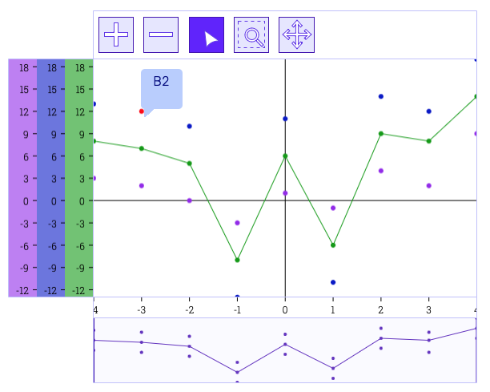
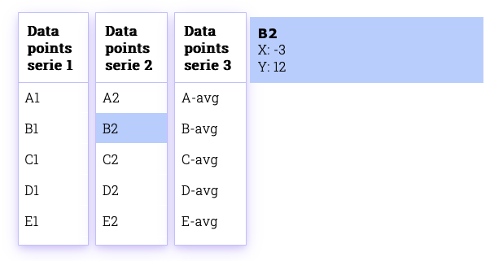

# Chart à la carte
## Interaktive Business Charts für das Kolibri Web UI Tookit

Bachelor Thesis von Valentina Giampa & Roger Kreienbühl

## Ausgangslage

Für Geschäftsapplikationen sind Datenvisualisierungstools ein wichtiger Bestandteil.
Bisherige Chart-Libraries bieten zwar verschiedene Chart-Typen, es fehlt jedoch ein Toolkit für interaktive Charts mit klassichem [MVC-Aufbau](https://ieeexplore.ieee.org/abstract/document/950428), damit die Daten und Logik vom "Aussehen" der Applikation getrennt sind.
Besonders im Geschäftsumfeld, wo viele Endgeräte im Einsatz sind, ist die Trennung der View wichtig, damit diese mit wenig Aufwand angepasst werden kann.

## Ziel der Arbeit

Erweiterung des bestehenden [Kolibri Web UI Toolkits](https://github.com/WebEngineering-FHNW/Kolibri) mit [Projektoren](https://dierk.github.io/Home/projectorPattern/ProjectorPattern.html) für die Datenvisualisierung, welche die Möglichkeit bieten Analysetools schnell und einfach zu bauen, individuell zu erweitern und beliebig auszutauschen.

## Ergebnisse

Im Rahmen dieses Projekts wurden verschiedene Projektoren erstellt, um eine oder mehrere Datenserien in einer Chart visualisieren zu können.

Für die Datenpunkte existieren ebenfalls Projektoren, die mit den Charts ein Binding haben.

## Business Charts Home Page

Die [Homepage](BusinessChartsDemoAndDocs/index.html) mit Live Demo und [ausführlicher Anleitung](BusinessChartsDemoAndDocs/demo/first-steps/first-steps.html).

## Technischer Kurzbeschrieb
Der [technische Kurzbeschrieb](https://github.com/rkreienbuehl/FHNW_ip6_Kolibri-Business-Charts/blob/main/BusinessCharts/docs/TECHNICAL_OVERVIEW.md)
gibt eine Übersicht über den groben Aufbau und die Features.

### Anwendungsideen

Der Figma [Klick-Prototyp](https://www.figma.com/proto/wjFrNkwuFoQM6mZREmWsWG/Kolibri-business-charts?page-id=201%3A4&node-id=201-4&starting-point-node-id=201%3A5&scaling=contain&show-proto-sidebar=1)
zeigt Ideen für weitere Projektoren und wie End User, wie zum Beispiel Datenanalyst*innen, die Charts für Analysen nutzen könnten.
