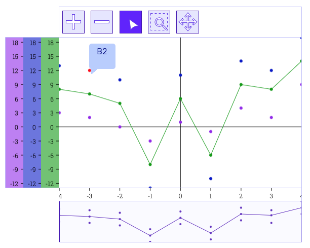

# FHNW IP6 - Interaktive Business Charts für das Kolibri Web UI Tookit

Bachelor Thesis von Valentina Giampa & Roger Kreienbühl

## Ausgangslage

Für Geschäftsapplikationen sind Datenvisualisierungstools ein wichtiger Bestandteil. 
Bisherige Chart-Libraries bieten zwar verschiedene Chart-Typen, es fehlt jedoch ein Toolkit für interaktive Charts mit klassichem [MVC-Aufbau](https://ieeexplore.ieee.org/abstract/document/950428), damit die Daten und Logik vom "Aussehen" der Applikation getrennt sind.
Besonders im Geschäftsumfeld, wo viele Endgeräte im Einsatz sind, ist die Trennung der View wichtig, damit diese mit wenig Aufwand angepasst werden kann.

## Ziel der Arbeit

Erweiterung des bestehenden [Kolibri Web UI Toolkits](https://github.com/WebEngineering-FHNW/Kolibri) mit [Projektoren](https://dierk.github.io/Home/projectorPattern/ProjectorPattern.html) für die Datenvisualisierung, welche die Möglichkeit bieten Analysetools schnell und einfach zu bauen, individuell zu erweitern und beliebig auszutauschen.

## Ergebnisse

Technischer Bericht [TODO]()

Technischer Beschrieb und Erste Schritte in ausführlicherer Form (EN): [howto.html](demo/first-steps/howto.html)

Technischer Beschrieb und Erste Schritte als Kurzbeschrieb (DE): [HOWTO.md](HOWTO.md)

Implementation von Projektoren als wiederverwendbare Chart-Elemente:
- Chart Projektoren
- Toolbar Projektor
- Achsen Projektoren
- Tooltip Projektoren
- Table View Projektor
- Detail View Projektor

Weitere Interaktionsbeispiele als [Klick-Prototyp](https://www.figma.com/proto/wjFrNkwuFoQM6mZREmWsWG/Kolibri-business-charts?page-id=201%3A4&node-id=201-4&starting-point-node-id=201%3A5&scaling=contain&show-proto-sidebar=1)

[//]: # (für fhnw website)
[//]: # (<iframe style="border: 1px solid rgba&#40;0, 0, 0, 0.1&#41;;" width="800" height="450" src="https://www.figma.com/embed?embed_host=share&url=https%3A%2F%2Fwww.figma.com%2Fproto%2FwjFrNkwuFoQM6mZREmWsWG%2FKolibri-business-charts%3Fpage-id%3D201%253A4%26node-id%3D201-4%26starting-point-node-id%3D201%253A5%26scaling%3Dcontain%26show-proto-sidebar%3D1" allowfullscreen></iframe>)

Ergebnisse der Usability Tests [TODO]()

[//]: # ()
[//]: # (## Datasets für Charts:)

[//]: # ()
[//]: # (- [Wochenstatistik Elektrizitätsbilanz - Erzeugung und Abgabe elektrischer Energie in der Schweiz]&#40;https://opendata.swiss/de/dataset/wochenstatistik-elektrizitatsbilanz-erzeugung-und-abgabe-elektrischer-energie-in-der-schweiz&#41;)

[//]: # (- [Elektrizitätserzeugung]&#40;https://opendata.swiss/de/dataset/elektrizitatserzeugung&#41;)

[//]: # (- [Elektrizitätsproduktionsanlagen]&#40;https://opendata.swiss/de/dataset/elektrizitatsproduktionsanlagen&#41;)